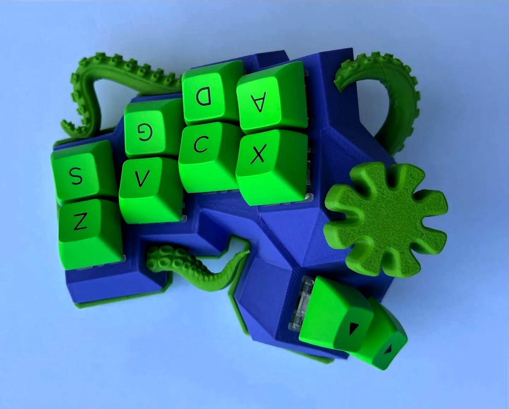
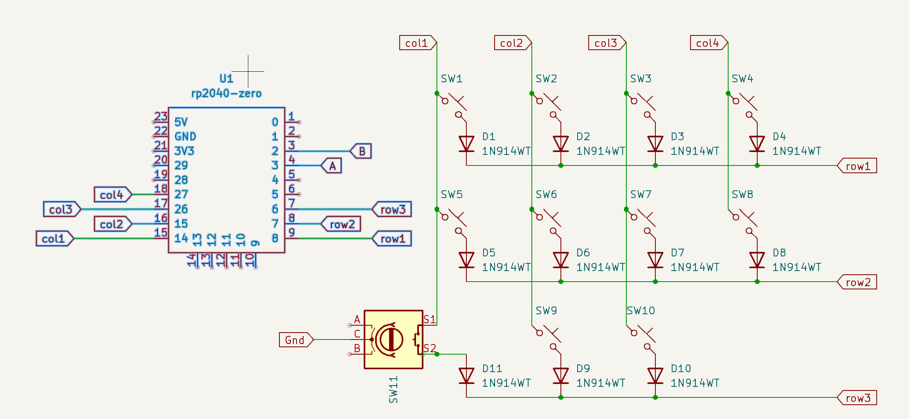

# Artsey of the Tentacle

Base Sexy Artsey from [gleb](https://gitlab.com/gleb_sexy/sexy-artsey-3)

# Build

| Item | Type | 
|-|-|
| FW        | QMK      | 
| MCU       | RP2040 Zero  | 
| Switches  | Cherry MX White |
| Keycaps   | Akko      | 
| Spe       | EC11 Encoder  | 

## Wiring

## Keymap

Inspired by [Artsey](https://artsey.io) and [taipo](https://inkeys.wiki/en/keymaps/taipo)

QK_BOOT = Sys:t

Encoder: 
    Hold = Sys layer
    Push = Mute
    Rotate = Mouse Wheel
    

